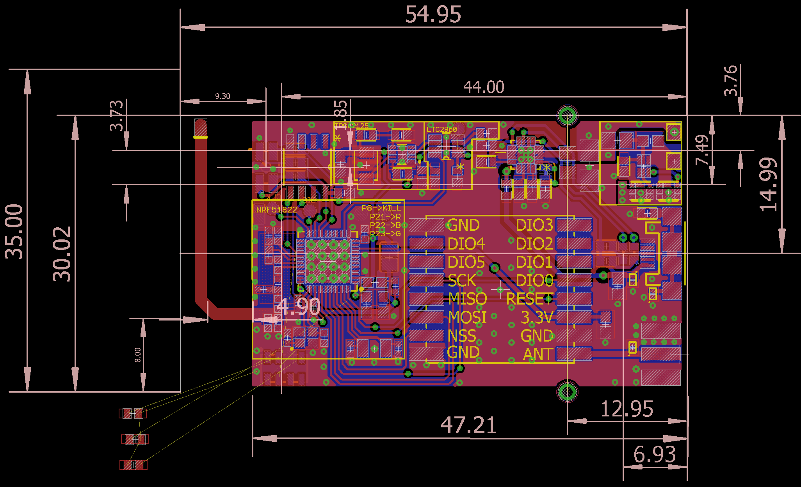

<h1 align="center">Lo-Talk</h1>

# About

Lo-Talk is an open-hardware ISM band off-grid communicator based on Nordic's NRF51822 and Semtech's LoRa module on SX1278. This device can be helpful in node to node communication and mesh networking over the ISM band and has hardware support for SOS alerts.
The device communication range was tested upto 500mm in an urban area without line of sight and maximum Tx Power 0.3W.

# Schematic

# Layout

# License
The source files are released under  [Creative Commons Attribution-NonCommercial-NoDerivatives 4.0 International License](http://creativecommons.org/licenses/by-nc-nd/4.0/) .
